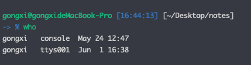

## shell 学习第一天

> 好处:
>
> - 脚本语言多半运行在比编译语言还高得层级,能够自己处理文件与目录之类的对象
>
> 缺点:
>
> - 一般情况下效率比较低

常用的脚本语言如 :shell,js,ruby

shell 脚本的过人之处

- 简单性:shell 是高级语言
- 可移植性:通过 POSIX 所定义的功能,可以在不通的系统上执行,无需更改
- 开发容易:短时间即可完成一个功能强大并且好用的脚本

```shell
who
```


```shell
who | wc -l //统计计算机用户的个数
```
| (管道)符号可以在两个程序之间建立管道,:who的输出,成了wc的输入
