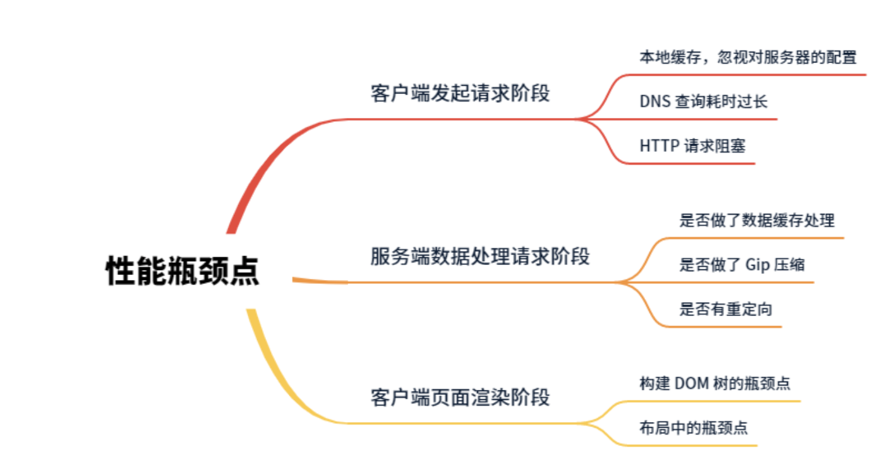

# 01 | 体系总览：性能优化体系及关键指标设定

比如 FPS、白屏、首屏、可操作等

白屏时间：指从输入内容（包括刷新，跳转等）后，到页面开始出现第一个字符的时间。这个过程包括 DNS 查询，建立 TCP 链接，发送首个 HTTP 请求（如果使用 HTTPS 还要介入 TLS 的验证时间），返回 HTML 文档，HTML 文档 Head 解析完毕。它的标准时间是 300ms

影响白屏的因素有哪些？

- DNS 查询时间过长
- 建立 TCP 请求链接太慢
- 服务器处理请求速度太慢
- 客户端下载，解析，渲染时间过长
- 没有做 Gzip 压缩，
- 缺乏本地离线化处理

首屏时间=白屏时间+渲染时间，它是指从浏览器输入地址并回车后，到首屏内容渲染完毕的时间。这期间不需要滚动鼠标或者下拉页面，否则无效

首屏时间可以拆分为白屏时间、数据接口响应时间、图片加载资源等

## 性能优化流程

- 指标设定
- 性能标准
- 收益评估
- 诊断清单
- 优化手段
- 性能立项
- 性能实践

## 性能指标采集及上报

- 指标分解
- 指标采集
- SDK 封装
- 统计埋点
- 上报策略
- 数据预处理

## 性能监控预警平台

性能数据处理后台，主要是在性能采集数据上报到性能平台后，对数据进行预处理、数据清洗和数据计算，然后生成前台可视化所需数据

性能可视化展现前台包括性能展示、性能监控预警，主要是对核心数据指标进行可视化展现，对性能数据波动进行监控，对超出阈值的数据给出短信或邮件报警

# 02 | 性能瓶颈点：从 URL 输入到页面加载整过程分析

当在地址栏中输入 url 之后，为了把 url 解析成 ip 地址，浏览器会向 DNS 服务器发起 DNS 查询获取 ip 地址，然后浏览器通过 IP 地址找到目标服务器，发起 tcp 三次握手和 TLS 协商，从而建立起 TCP 连接

在建立完 tcp 连接之后，浏览器就可以发起 http 请求了，在服务端收到请求之后，对请求进行响应，浏览器在响应中拿到数据，并进行解析和渲染，最后在用户面前就出现了一个网页。

构建 DOM 树，影响的性能点：

- 当 html 标签不符合 Web 语义话的时候，浏览器就需要花费更多的时间去解析 DOM 标签的含义。
- DOM 节点数量越多，构建 dom 树的时间就会越长，进而延长解析时间，拖慢页面的展示速度
- 文档中包含 script 标签的时候，因为无论是 cssdom 还是 dom 都是可以被 js 代码多访问并且修改的，所以一旦遇到 script 标签，dom 的构造过程就会暂停，等待服务器请求脚本，在脚本加载完后才能继续

外部脚本的加载时机一定要确定好，能够延迟加载就选用延迟加载。另外，我们可以通过使用 defer 和 async，告诉浏览器在等待脚本下载期间不阻止解析过程，这样做可以明显提升性能

## 布局中的瓶颈点

减少页面的重排

# 03 | 案例分析：移动端 M 站性能优化落地注意事项

# 04 | 指标采集：首屏时间指标采集具体办法

> 首屏时间 = `DOMContentLoaded` 时间 = `performance.timing.domContentLoadedEventEnd` - `performance.timing.fetchStart`

# 05 | 指标采集：白屏、卡顿、网络环境指标采集方法

- 白屏
> 白屏时间 = 页面开始展示时间点 - 开始请求时间点

> 白屏时间 FP = `performance.timing.domLoading` - `performance.timing.navigationStart`

- 卡顿指标采集
FPS（每秒显示帧数）

