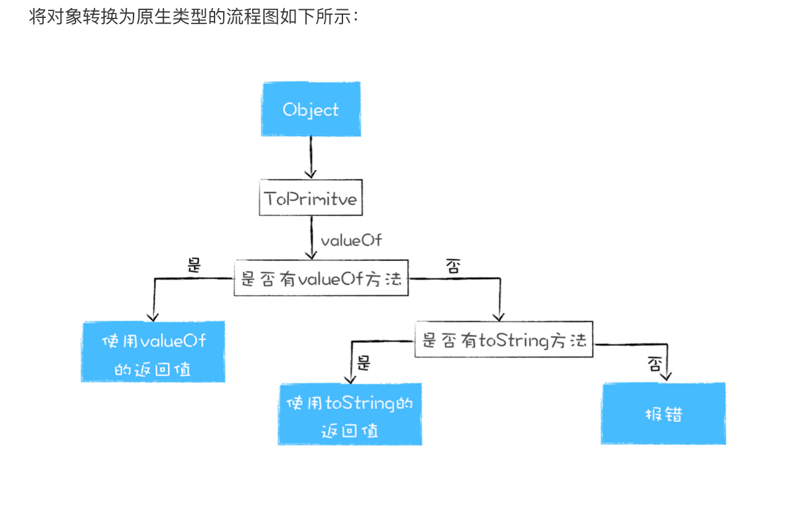

# 07｜类型转换：V8是怎么实现1+“2”的？

## 什么是类型系统?(类型的概念,js操作类型的策略)
> 每种语言都定义了自己的类型,还定义了如何操作这些类型,另外还定义了这些类型应该如何相互作用,我们就把这称为类型系统

对于机器语言来说,所有的数据都是一堆二进制代码,cpu处理这些数据的时候,并没有类型的概念,cpu所做的仅仅是移动数据,比如对其进行移位,相加或相乘

在高级语言中,我们都会为操作的数据赋予指定的类型,类型可以确认一个值或者一组值,具有特定的意义和目的.所以,类型是高级语言中的概念

