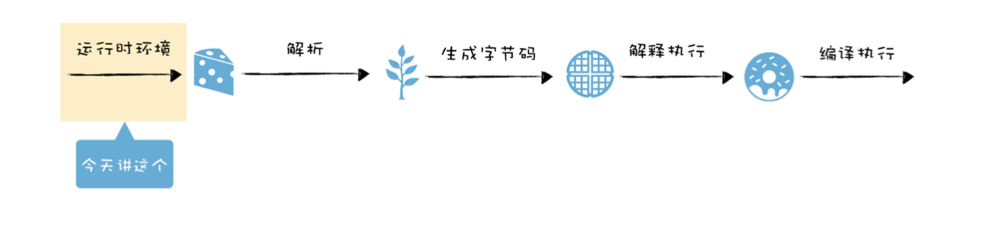
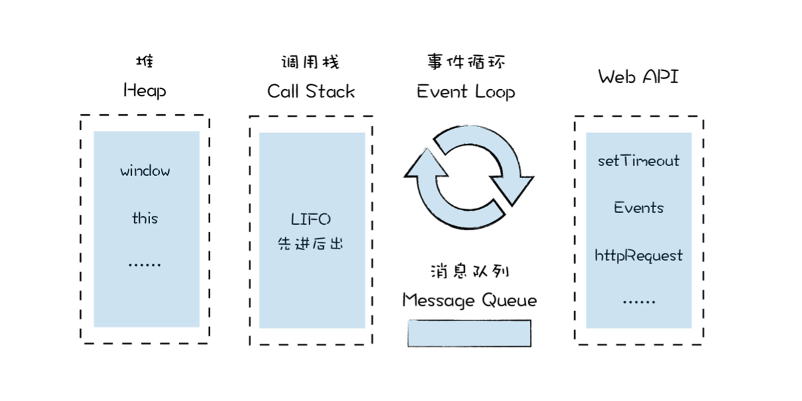
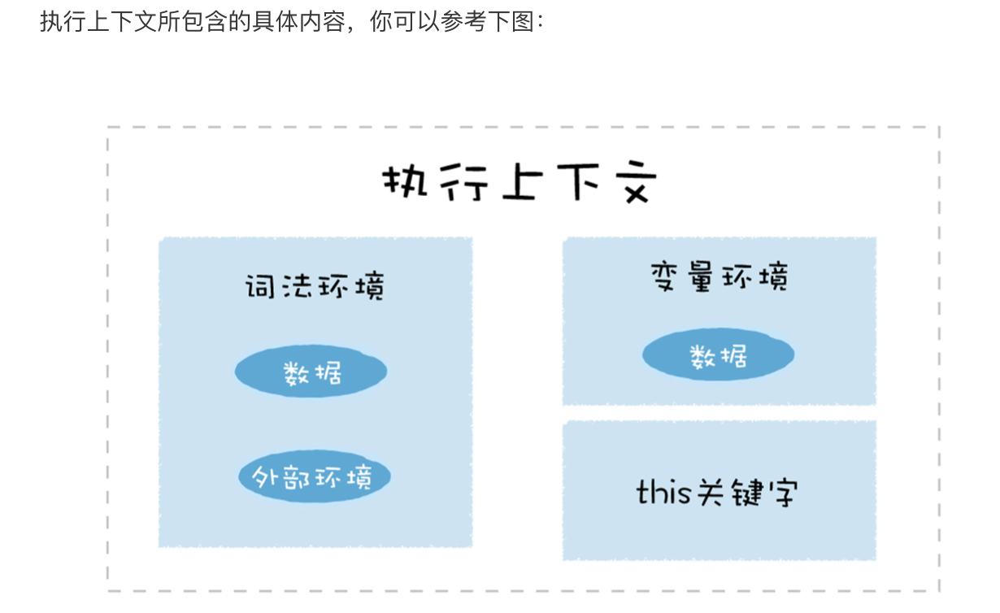

# 09 | 运行时环境：运行JavaScript代码的基石

js是一门基于对象的语言,它能实现诸如函数是一等公民,闭包,函数式编程,原型继承等

当想要执行一段js代码时,只需要将代码丢给V8虚拟机,V8便会执行并返回给你结果
这是因为在执行js代码之前,v8就已经准备好了代码的运行时环境,这个环境包括了堆空间和栈空间,全局执行上下文,全局作用域,内置的内建函数,宿主环境提供的扩展函数和对象,还有消息循环系统.

准备好运行时环境之后,V8才可以执行js代码,这包括解析源码,生成字节码,解释执行或者编译执行这一系列操作

运行时环境

## 什么是宿主环境?

宿主环境在这里就是浏览器,主要为V8提供基础的消息循环系统,全局变量,Web API,而V8的核心是实现了es标准,v8只提供了es定义的一些对象和一些核心的函数,这包括object,function,string,除此之外,v8还提供了垃圾回收器,协程等基础内容.

## 构建数据存储空间:堆空间和栈空间
栈空间主要是用来管理js函数调用的,栈是内存中连续的一块空间,同时栈结构是“先进先出”的策略,在函数调用过程中.涉及到上下文相关的内容都会存放在栈上.比如原生类型,引用到的对象的地址,函数的执行状态,this值等斗鸡存在栈上,当一个函数执行结束,那么该函数的执行上下文便会被销毁掉.

栈空间的最大的特点是空间连续,所以在栈中每个元素的地址都是固定的,因此栈空间的查找效率非常高

堆空间是一种树形的存储结构,用来存储对象类型的离散的数据.

## 全局执行上下文和全局作用域
V8用执行上下文来维护执行当前代码所需要的变量声明,this指向等

执行上下文主要包含三部分:变量环境,词法环境和this关键字.
在浏览器环境中:全局执行上下文中包括了window对象,默认指向window的this关键字,还有一些web api,比如settimeout,XMLHttprequest等内容

## 构造时间循环系统

v8有一个主线程,用来执行js和执行垃圾回收等工作,v8是寄生在宿主环境中的,他并没有自己的主线程,而是适应宿主所提供的主线程,V8所执行的代码都是在宿主的主线程上执行的
