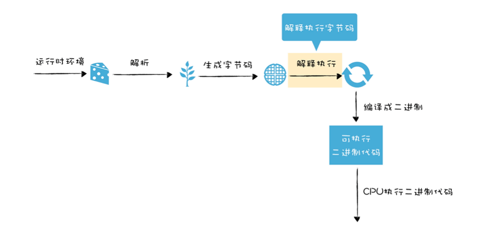
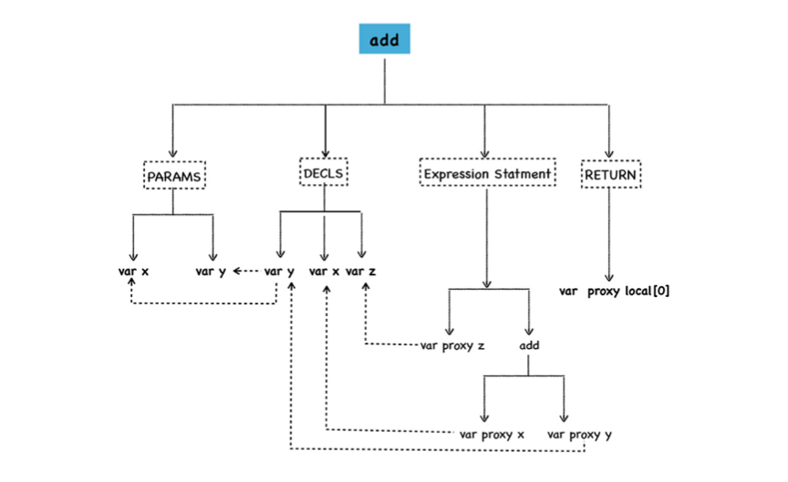
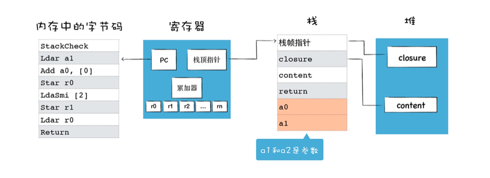

# 14｜字节码（二）：解释器是如何解释执行字节码的？

字节码的解释执行在编译流水线中的位置如下图


## 如何生成字节码?
```js
function add(x,y){
    var z= x+y
    return z
}
console.log(add(1,2))
```
解析过程如下



因为解释器就是模拟物理机器来执行字节码的,比如可以实现如取指令,解析指令,执行指令,存储数据等,所以解释器的执行架构和cpu处理机器代码的架构类似.

通常有两种类型的解释器
- 基于栈,基于栈的解释器使用栈来保存函数参数,中间运算结果,变量等
- 基于寄存器的虚拟机则支持寄存器的指令操作,使用寄存器来保存参数,中间计算结果

基于寄存器的解释器架构,具体可参考如下

