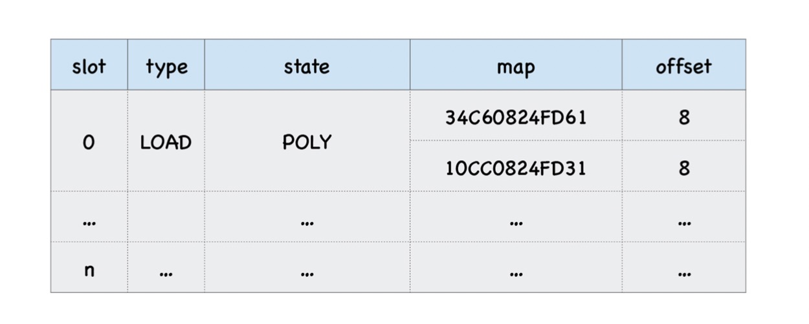

# 16 | 答疑： V8是怎么通过内联缓存来提升函数执行效率的？

## 什么是内联缓存(IC)
内联缓存就是为每个函数添加了一个缓存,当第一次执行该函数时,v8会将函数中的存储,加载和调用相关的中间结果保存到反馈像向量中.

当再次执行时,v8就要去反馈向量中查找行管中间信息,如果命中了,那么就直接使用中间信息

一个反馈向量的一个插槽中可以包含多个隐藏类的信息
- 如果一个插槽中只包含1个隐藏类,那么我们称这种状态为单态
- 如果一个插槽中包含了2—4个隐藏类,那我们称这种状态为多态
- 如果一个插槽中超过4个隐藏类,那我们称这种状态为超类

函数的单一职责,也是同样的道理,如果函数的入参格式是固定的,那么就不会在反馈向量的隐藏类中存在多条信息,这样就避免了查找对比浪费的时间
```js
function l(o) {
	return o.x
}
var o = {x:1,y:2}
var o1 = {x:1,y:2,z:3}
for (var i = 0;i<100;i++) {
	l(o)
	l(o1)
}
```
生成的隐藏类中包含如下信息:



V8引入的ic,会监听每个函数的执行过程,并在一些关键的地方埋下监听点,这些包括了加载对象属性,给对象属性赋值,还有函数调用,v8会将监听到的数据写入一个称为反馈向量的结构中,同时v8会为每个执行的函数维护一个反馈向量,有了反馈向量混存的临时数据,v8就可以缩短对象属性的查找路径,从而提升执行效率

