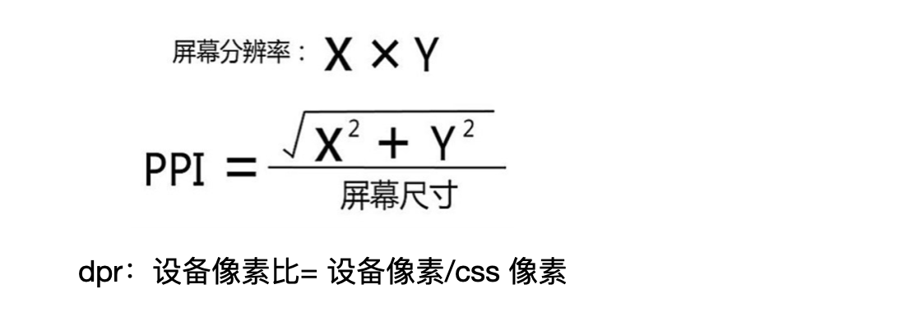

# css 单位总结
## 什么是响应式布局
响应式布局就是一个网站可以兼容多个终端，而不用为每个终端做一个指定的版本。。

## 什么是设备像素
设备像素也是物理像素，单位是 pt，pt 在 css 标准中属于绝对单位，显示屏是由一个个物理像素单位组成的，

## 设备像素和分辨率之间的关系
分辨率用的就是设备像素，例如375*667，

## 什么是 css 像素
css 像素的单位是 px，在css 规范中，css 有两种单位：绝对单位和相对单位，px 是一个相对单位，是相对于设备像素

## 设备像素比的作用是什么
window.devicePixelRatio获取像素比，作用是在不同的设备像素比的

## 每英寸像素点ppi 和 设备像素比dpr
ppi：表示每英寸所包含的像素点数目，数目越高，显示的也就越清晰




dpr：设备像素比= 设备像素/css 像素
```html
<meta name="viewport" width=“device-width">就是设置css 像素=物理像素
```

px/rem/vh/vw之间的关系

一般设计稿的大小尺寸是按照 iphone6的大小设置的，也就是750*1334，
这个时候我们在写的时候，css 的单位需要按照设计稿上的大小/2，得到我们需要的。
rem