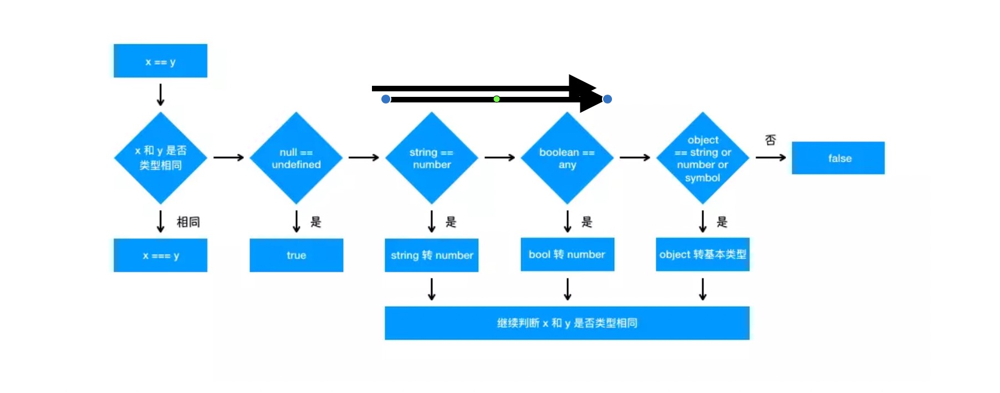

#04_[]==![]

==执行的判断操作
- 首先判断两者类型是否相同,相同的话就是比大小
- 类型不相同的话,那么就进行类型转换
- 会先判断是否对比null和undefined,是的话就单会true
- 判断两者类型是否为string和number,是的话就会将string转换成number
- 判断其中一方是否为boolean,是的话就会把boolean转为number,在进行判断
- 判断其中一方是否为object,且另一方为string,number或者symbol,是的话就会把object转为原始类型在进行判断

所以在执行[] == ![]的时候
1. ![] 是boolean值,且为false,也就是最终会转换成number 0
2. [] 是object类型,首先执行valueOf(),返回的是[],接着执行toString(),然后返回为‘’,‘’转换为number是0

