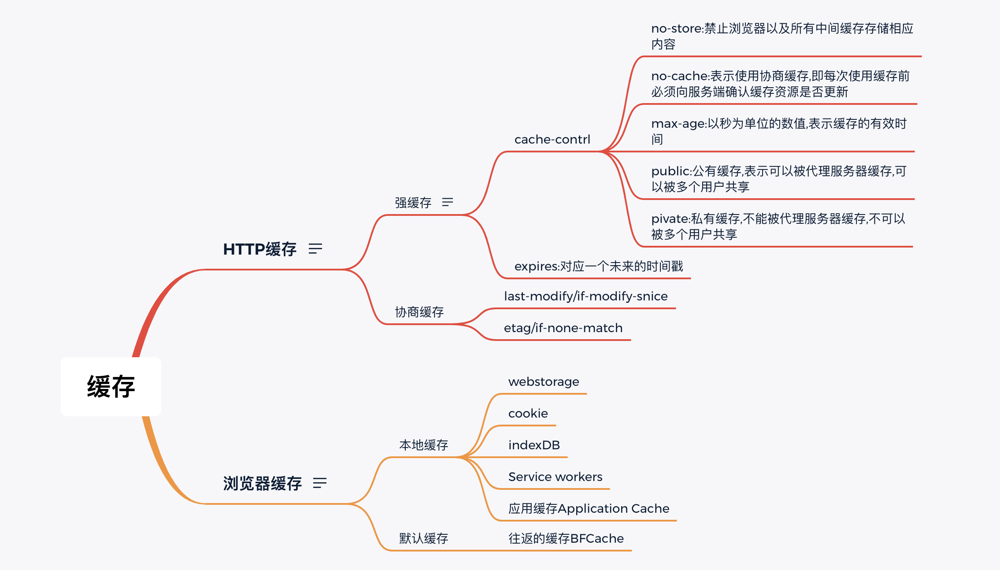
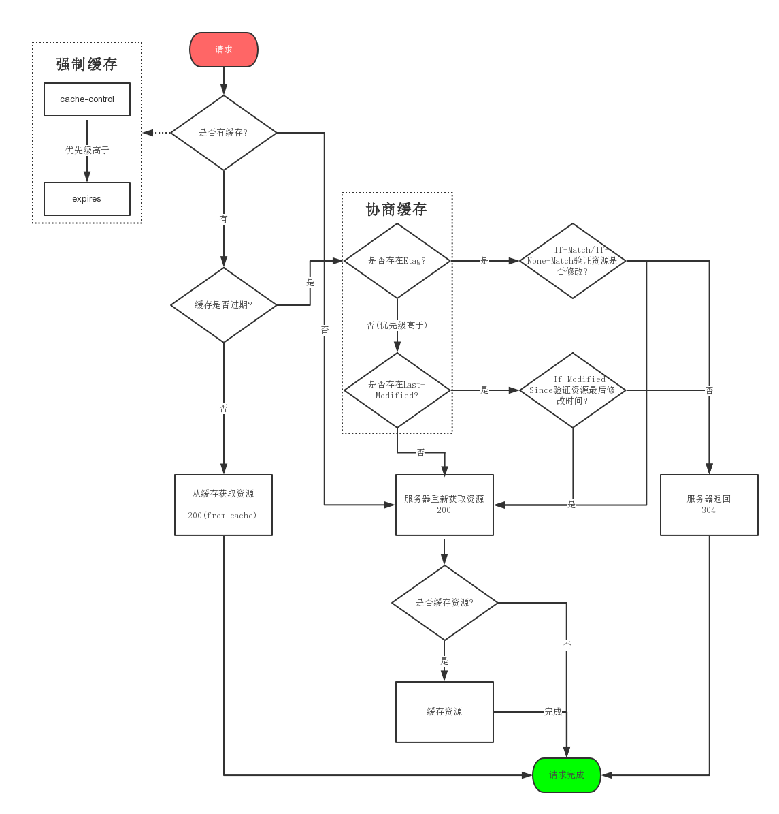

# 缓存

> 缓存策略可以缩短网页请求资源的距离，减少延迟，并且由于缓存文件可以重复利用，还可以减少带宽，降低网络负荷

## HTTP缓存

> HTTP缓存:主要存在于服务器请求传输时需要记录的一些参数，在服务器代码上设置
>
> ⚠️强缓存:cache-control 的 max-age 优先级高于 Expires
>
> ⚠️协商缓存:etag的优先级高于last-modify

## 浏览器缓存

> 浏览器缓存:主要是由前端JS代码主动存储的某些参数

**缓存流程两点总结：**

**1、浏览器每次发起请求，都会在浏览器缓存里寻找该请求的标识和缓存内容。**

**2、浏览器每次收到返回结果，都会在浏览器缓存里保存该标识和缓存内容。**

