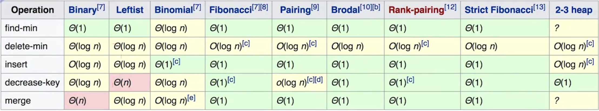
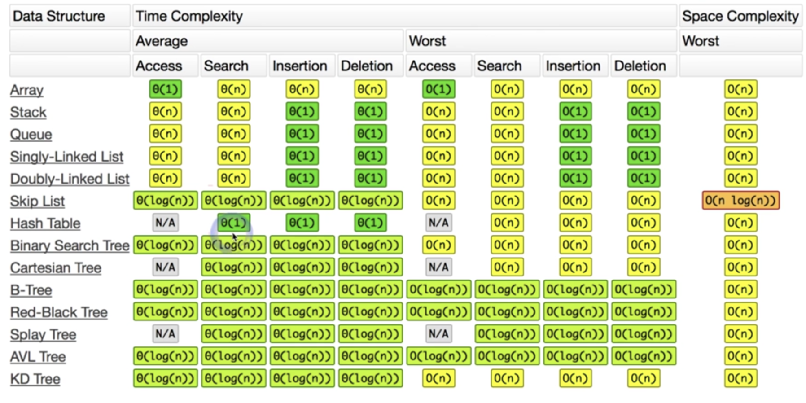

## - 如何计算算法的复杂度

- **时间复杂度**
- **空间复杂度**

##  - 理论讲解：数组&链表

- **数组**array
  - 在内存中的地址连续
  - 访问的时间复杂度为O(1)
  - 插入insert和删除delete的时间复杂度为O(n)
- **链表**linked list
  - 在内存中的地址可以不连续,通过指针链接
  - 访问的时间复杂度为O(n)
  - 插入insert和删除delete的时间复杂度为O(1)

## - 理论讲解：堆栈&队列

- **队列**:先进先出
- **堆栈**:先进后出

## - 优先队列

> 正常入,按照优先级出

- heap堆实现,二叉堆(react的优先级就是使用堆实现的)

- 二叉搜索树

## - set&&map

